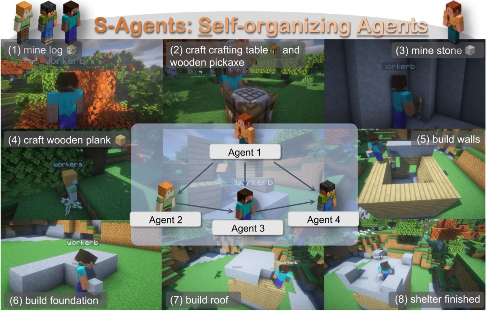
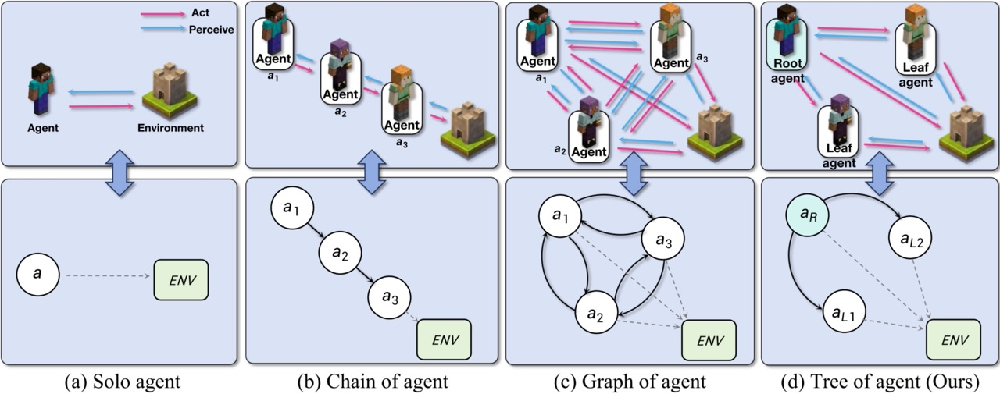
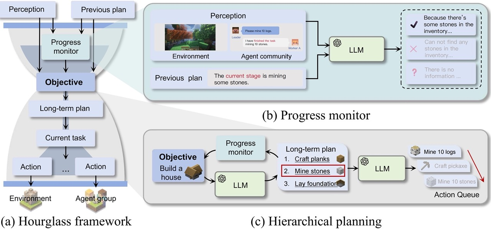
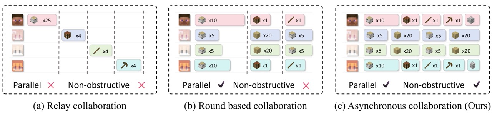
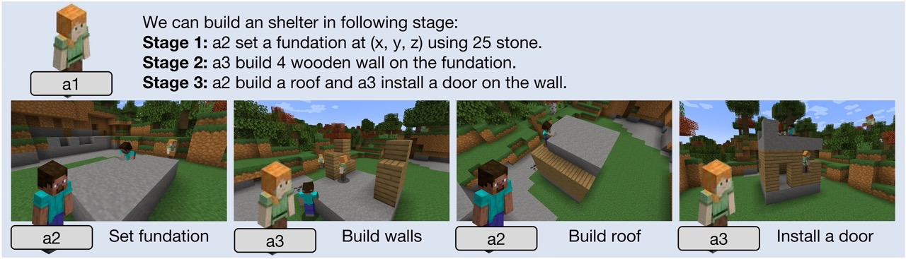
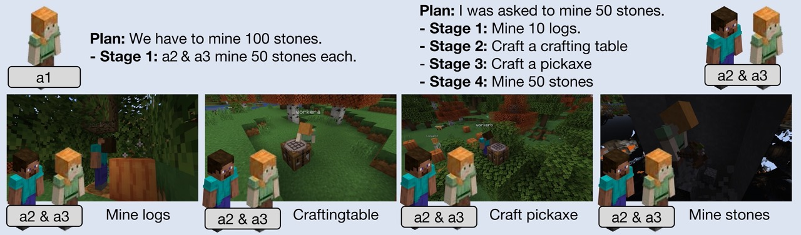
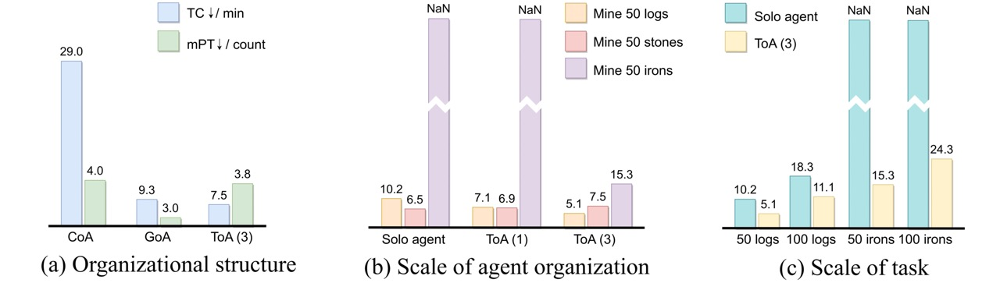
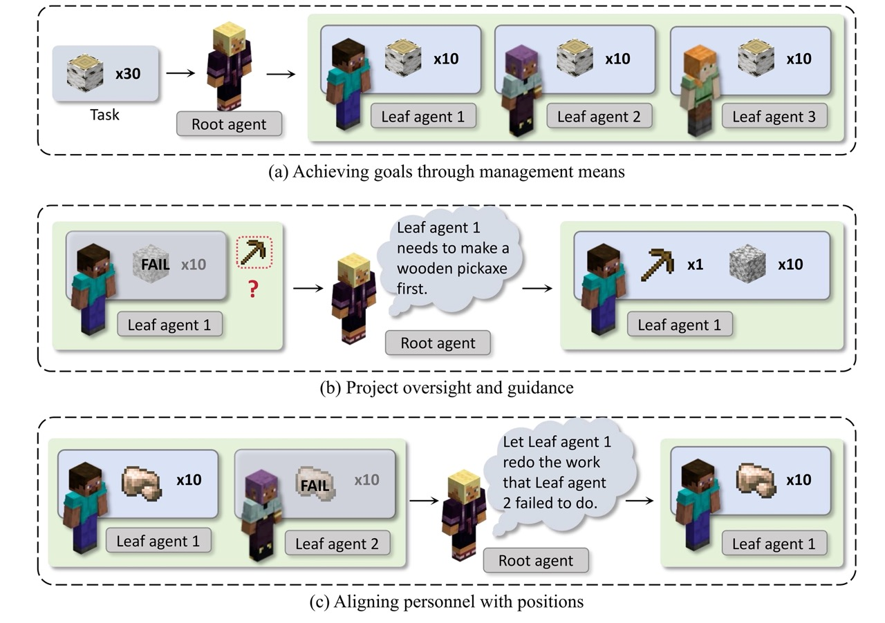
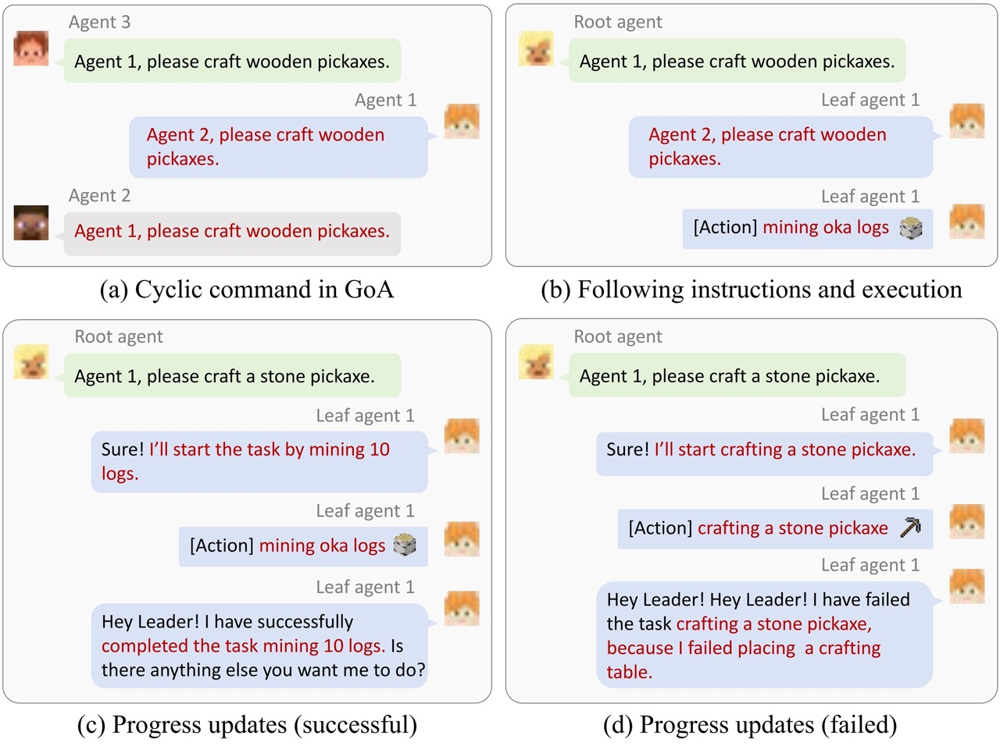

<p align="center">
  
</p>

# S-Agents: Self-organizing Agents in Open-ended Environments
> **[S-Agents: Self-organizing Agents in Open-ended Environments](https://arxiv.org/abs/2402.04578)**  
> Jiaqi Chen*, Yuxian Jiang*, Jiachen Lu and Li Zhang  
> Zhang Vision Group, Fudan Univerisity

In open-ended settings, optimizing collaboration for efficiency and effectiveness demands flexible adjustments. Despite this, current research mainly emphasizes fixed, task-oriented workflows and overlooks agent-centric organizational structures. Drawing inspiration from human organizational behavior, we introduce a self-organizing agent system (S-Agents) with a “tree of agents” structure for dynamic workflow, an “hourglass agent architecture” for balancing information priorities, and a “non-obstructive collaboration” method to allow asynchronous task execution among agents. This structure can autonomously coordinate a group of agents, efficiently addressing the challenges of an open and dynamic environment without human intervention.

### Methodology

1) A "tree of agents" organizational structure, comprising a root node (leadership agent) and multiple leaf nodes (executor agents). The leadership agent autonomously arranges a flexible workflow without the need for human intervention.
<p align="center">
  
</p>


2) An hourglass agent architecture that strives to balance priorities between the agent community and the physical environment, promoting coordinated actions.
<p align="center">
  
</p>

3) A Non-obstructive collaboration approach breaks away from the constraint of multiple intelligent agents sharing a fixed convergence beat, allowing agents to asynchronously execute collaborative tasks. This method is designed to alleviate delays induced by the slowest agent in each round, thereby enhancing overall efficiency.
<p align="center">
  
</p>

## Experiments
### Experiment setup
**Collective collection:**
Agents in the group must gather a specified amount of basic resources like wood, stone, and iron.
The difficulty escalates when amassing a substantial quantity of resources, requiring agents to navigate numerous open-ended world events.
The considerable workload emphasizes the preference for a _**division of labor**_.

**Collective shelter construction:**
For a basic shelter, agents need a stone foundation, wooden walls, and a stone ceiling.
Two agents start with wooden planks, one with stone. This task assesses the leadership agent's _**task assignment**_ and challenges the consideration of _**task dependencies**_.
Effective progress management, an unexplored aspect in prior research, is crucial for successful, staged construction.

### Metrics
We utilize the subsequent metrics:
**Time cost (TC)**: the time resources needed to execute a task. Reduced time expenditure suggests greater system efficiency. "NaN" denotes no progress for over 40 minutes when attempts exceed 5 without success.
**Mean prompt times (mPT):** the average times of hierarchical planning iterations of each agent.
<p align="center">
  
</p>

<p align="center">
  
</p>

From the table provided, we can glean the following insights. For a more detailed understanding, please consult our paper:

1) Parallelization can indeed save time, contingent upon the presence of an efficient organizational structure. 
2) Mutual redundancy within multi-agent systems holds the potential to bolster robustness significantly. This is primarily due to the proactive nature of leadership agents, who promptly orchestrate replacements for any failed agents, ensuring continuous operation.


<p align="center">
  
</p>

### The emergence of organizational behavior

In organizational management, leaders adopting a _**non-hands-on approach**_ to large-scale tasks is a rational consideration based on the effective allocation of human resources and strategic management practices. 
<p align="center">
  
</p>

During collaborative processes in agent organization, we've observed leaf agents displaying behaviors that mimic human employees.
<p align="center">
  
</p>


## 📜 Bibtex
If you find this work useful for your research, please cite our paper:
```bibtex
@article{chen2024sagent,
  title={S-Agents: self-organizing agents in open-ended environments},
  author={Chen, Jiaqi and Jiang, Yuxian and Lu, Jiachen and Zhang, Li},
  journal={arXiv preprint arxiv:2402.04578},
  year={2024}
}
```
