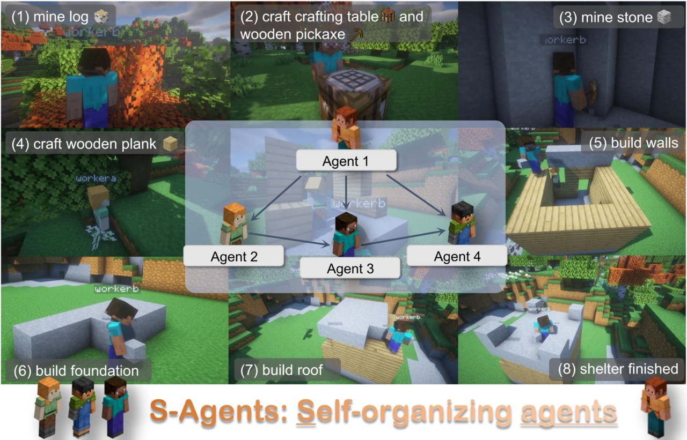

<p align="center">
  
</p>

# S-Agents: self-organizing agents in open-ended environment
> **[S-Agents: self-organizing agents in open-ended environment](https://arxiv.org/pdf/2402.04578.pdf)**  
> Jiaqi Chen*, Yuxian Jiang*, Jiachen Lu and Li Zhang  
> Zhang Vision Group, Fudan Univerisity

In open-ended settings, optimizing collaboration for efficiency and effectiveness demands flexible adjustments. Despite this, current research mainly emphasizes fixed, task-oriented workflows and overlooks agent-centric organizational structures. Drawing inspiration from human organizational behavior, we introduce a self-organizing agent system (S-Agents) with a “tree of agents” structure for dynamic workflow, an “hourglass agent architecture” for balancing information priorities, and a “non-obstructive collaboration” method to allow asynchronous task execution among agents. This structure can autonomously coordinate a group of agents, efficiently addressing the challenges of an open and dynamic environment without human intervention.


## 📜 Bibtex
If you find this work useful for your research, please cite our paper:
```bibtex
@article{chen2024sagent,
  title={S-Agents: self-organizing agents in open-ended environment},
  author={Chen, Jiaqi and Jiang, Yuxian and Lu, Jiachen and Zhang, Li},
  journal={arXiv preprint arxiv:2402.04578},
  year={2024}
}
```
